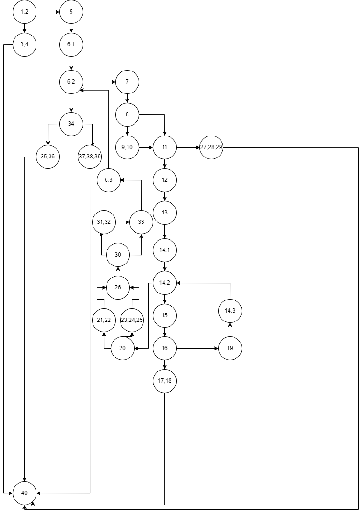

Теодора Николовска, 223214

2. Control Flow Graph

3. Цикломатската комплексност

Според формулата за пресметување на цикломатска комплексност, добив:
#Nodes = 31
#Edges = 39
E-N+2=39-31+2=8+2=10

Доколку пресметаме цикломатска комплексност преку броење на предикатите (if условите), добив:
P=9
P+1=10
if услови имаме во линија брoj: 2, 6, 8, 11, 14, 16, 20, 30, 34

Исто така со броење на регионите излегуваат точно 10 региони, 9 посебните региони и плус еден што е надворешен.

4. Тест случаи според критериумот Every branch

1.Test case: Null item list
List<Item> ListItemNull = null;
assertThrows(RuntimeException.class, () -> SILab2.checkCart(ListItemNull, 200), "allItems list can't be null!");
-Тестирам дали методот правилно ќе фрли исклучок кога му се прати null вредност за листата со ставки. Ако методот фрли исклучок со порака "allItems list can't be null!", тоа значи дека условот "if(allItems == null)" е исполнет

2.Test case: Insufficient payment
List<Item> itemListInsufficientPayment = new ArrayList<>();
itemListInsufficientPayment.add(new Item("Item1", "123456789", 400, 0));
assertFalse(SILab2.checkCart(itemListInsufficientPayment, 200), "Insufficient payment");
-Тестирам дали збирот на цените на ставките го надминува износот за плаќање, во мојот случај ќе врати false и тестот ќе помине

3.Test case: Empty item list
assertTrue(SILab2.checkCart(new ArrayList<>(), 100), "allItems list can't be null!");
-Тестирам дали дадената листа е празна, кога е празна тестот поминува, според нашиот мојот тестот поминува

4.Test case: Valid item list
List<Item> itemListValid = new ArrayList<>();
itemListValid.add(new Item("Item1", "123456789", 200, 0.1f));
itemListValid.add(new Item("Item2", "112345678", 400, 0));
assertTrue(SILab2.checkCart(itemListValid, 1000), "Valid item list");
-Тестирам како методот се однесува кога му се дадена валидна листа со ставки. Во овој случај вредностите се валидни и вратената вредност ќе биде true и тестот ќе помине

5.Test case: Invalid barcode
List<Item> itemListInvalidBarcode = new ArrayList<>();
itemListInvalidBarcode.add(new Item("Item1", "1C2345678", 500, 0.2f));
assertThrows(RuntimeException.class, () -> SILab2.checkCart(itemListInvalidBarcode, 1000), "Invalid character in item barcode!");
-Тестирам кога е пратена листа со ставки кои имаат невалиден баркод. Во овој случај, е креирана листа со една ставка која има невалиден баркод. Во овој случај методот ќе фрли фрли исклучок со порака "Invalid character in item barcode!", тоа значи дека условот "if(allowed.indexOf(c) == -1)" е исполнет

6.Test case: Price over 300 with discount and barcode starting with zero
List<Item> itemListPriceOver300 = new ArrayList<>(); 
itemListPriceOver300.add(new Item("Item1", "0123456789", 600, 0.1f)); 
assertTrue(SILab2.checkCart(itemListPriceOver300, 350), "Expected true for price over 300 with discount and barcode starting with zero");
-Тестирам дали листата содржи ставка со валиден баркод кој започнува со 0, дали цената на таа ставка е поголема од 300 и дали има попуст поголем од 0. Доколку ова е исполнето се исполнува и условот "if(item.getPrice() > 300 && item.getDiscount() > 0 && item.getBarcode().charAt(0) == '0')"

7.Test case: Item name is null, should set to "unknown"
List<Item> itemListNullName = new ArrayList<>();
Item nullNameItem = new Item(null, "123456789", 500, 0.1f);
itemListNullName.add(nullNameItem);
SILab2.checkCart(itemListNullName, 1000);
assertEquals("unknown", nullNameItem.getName(), "Expected item name to be set to 'unknown'");
-Тестирам дали името на ставката е "null", доколку е тоа треба да се промени во "unknown". Во assertEquals проверуваме дали името е променето во "unknown", доколку е тестот поминува.

8.Test case: No barcode
List<Item> itemListNoBarcode = new ArrayList<>();
itemListNoBarcode.add(new Item("Item1", null, 400, 0.1f));
assertThrows(RuntimeException.class, () -> SILab2.checkCart(itemListNoBarcode, 100), "No barcode!");
-Тестирам дали внесениот баркод е "null". Со методот assertThrows се проверува дали методот фрла исклучок со пораката  "No barcode!", доколку фрли тоа значи дека тестот поминал и се исполнил условот "if(item.getBarcode() != null)"

5. Тест случаи според критериумот Multiple Condition

1.Test case: price>300, discount>0, first barcode character ="0"
List<Item> itemListCase1 = new ArrayList<>();
itemListCase1.add(new Item("Item1", "0123456789", 400, 0.1f));
assertTrue(SILab2.checkCart(itemListCase1, 1000), "Expected true");
-Доколку сите услови се исполнети, методот ќе врати true и тестот ќе помине.

2.Test case: price>300, discount>0, first barcode character !="0"
List<Item> itemListCase2 = new ArrayList<>();
itemListCase2.add(new Item("Item1", "1123456789", 400, 0.1f));
assertTrue(SILab2.checkCart(itemListCase2, 1000), "Expected true");
-Доколку сите услови се исполнети, методот ќе врати true и тестот ќе помине.

//3. Test case: price>300, discount==0, first barcode character ="0"
List<Item> itemListCase3 = new ArrayList<>();
itemListCase3.add(new Item("Item1", "0123456789", 400, 0));
assertTrue(SILab2.checkCart(itemListCase3, 1000), "Expected true");
-Доколку сите услови се исполнети, методот ќе врати true и тестот ќе помине.

4. Test case: price>300, discount==0, first barcode character !="0"
List<Item> itemListCase4 = new ArrayList<>();
itemListCase4.add(new Item("Item1", "1123456789", 400, 0));
assertTrue(SILab2.checkCart(itemListCase4, 1000), "Expected true");
-Доколку сите услови се исполнети, методот ќе врати true и тестот ќе помине.

//5. Test case: price==300, discount>0, first barcode character ="0"
List<Item> itemListCase5 = new ArrayList<>();
itemListCase5.add(new Item("Item1", "0123456789", 300, 0.1f));
assertTrue(SILab2.checkCart(itemListCase5, 1000), "Expected true");
-Доколку сите услови се исполнети, методот ќе врати true и тестот ќе помине.

6.Test case: price==300, discount>0, first barcode character !="0"
List<Item> itemListCase6 = new ArrayList<>();
itemListCase6.add(new Item("Item1", "1123456789", 300, 0.1f));
assertTrue(SILab2.checkCart(itemListCase6, 1000), "Expected true");
-Доколку сите услови се исполнети, методот ќе врати true и тестот ќе помине.

7. Test case: price==300, discount==0, first barcode character ="0"
List<Item> itemListCase7 = new ArrayList<>();
itemListCase7.add(new Item("Item1", "0123456789", 300, 0));
assertTrue(SILab2.checkCart(itemListCase7, 1000), "Expected true");
-Доколку сите услови се исполнети, методот ќе врати true и тестот ќе помине.

8. Test case: price==300, discount==0, first barcode character !="0"
List<Item> itemListCase8 = new ArrayList<>();
itemListCase8.add(new Item("Item1", "1123456789", 300, 0));
assertTrue(SILab2.checkCart(itemListCase8, 1000), "Expected true");
-Доколку сите услови се исполнети, методот ќе врати true и тестот ќе помине.

-Unit тестовите ги напишав според сите можни комбинации (T-True, F-False), односно 
price>300 && discount>0 && Barcode.charAt(0) == '0'
T            T             T,
T            T             F,
T            F             T,
T            F             F,
F            T             T,
F            T             F,
F            F             T,
F            F             F
-Односноо според ова вкупен број на test-cases e 8.
